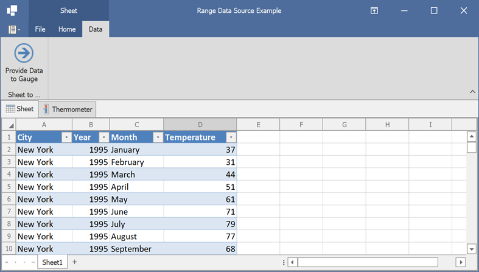

<!-- default badges list -->

<!-- default badges end -->

# Spreadsheet Control for WinForms - Use Cell Range as a Data Source

This example demonstrates how to select a worksheet range and use it as a data source for [Linear Gauge](https://docs.devexpress.com/WindowsForms/18226/controls-and-libraries/gauges/concepts/gauge-types/linear-gauges) and [Data Grid](https://docs.devexpress.com/WindowsForms/634/controls-and-libraries/data-grid/data-binding) controls.

Select the range containing data and click **Provide Data to Gauge**. The data source is created and passed to all data-aware controls. Switch to the Thermometer tab to see the linear gauge and a grid controls bound to the worksheet range.

## Implementation Details

The [Range.GetDataSource](https://docs.devexpress.com/OfficeFileAPI/DevExpress.Spreadsheet.CellRange.GetDataSource.overloads) method call creates the data binding range. The [RangeDataSourceOptions.UseFirstRowAsHeader](https://docs.devexpress.com/OfficeFileAPI/DevExpress.Spreadsheet.RangeDataSourceOptions.UseFirstRowAsHeader) option allows you to automatically name columns in the data source. The [DataSourceColumnTypeDetector](https://docs.devexpress.com/OfficeFileAPI/DevExpress.Spreadsheet.RangeDataSourceOptions.DataSourceColumnTypeDetector) option is used to specify a custom object that provides column names and determines column types. The [DataBindingCollection.Error](https://docs.devexpress.com/OfficeFileAPI/DevExpress.Spreadsheet.WorksheetDataBindingCollection.Error) event is handled to obtain additional information if any error occurs during data binding.

## Files to Review

* [Form1.cs](./CS/RangeDataSource/Form1.cs) (VB: [Form1.vb](./VB/RangeDataSource/Form1.vb))
* [MyColumnDetector.cs](./CS/RangeDataSource/MyColumnDetector.cs) (VB: [MyColumnDetector.vb](./VB/RangeDataSource/MyColumnDetector.vb))

## More Examples

* [How to: Bind a Worksheet to a Generic List or a BindingList Data Source](https://github.com/DevExpress-Examples/how-to-bind-a-worksheet-to-a-generic-list-or-a-bindinglist-data-source)

## Documentation

* [Data Binding in WinForms Spreadsheet Control
](https://docs.devexpress.com/WindowsForms/117679/controls-and-libraries/spreadsheet/data-binding)
* [Data Binding (Task-Based Examples)](https://docs.devexpress.com/WindowsForms/117779/controls-and-libraries/spreadsheet/examples/data-binding)
